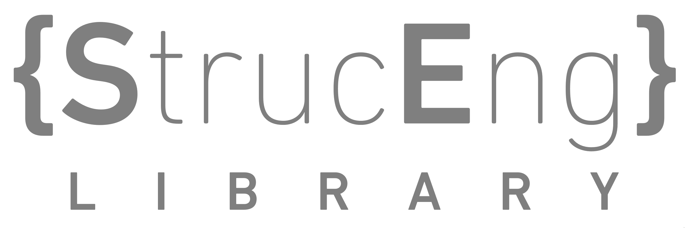

Welcome to the StrucEng Library. This project contains all assets to build our website.

For a tutorial on how to make changes on the website, please read [tutorial_edit_website.md](./tutorial_edit_website.md).
