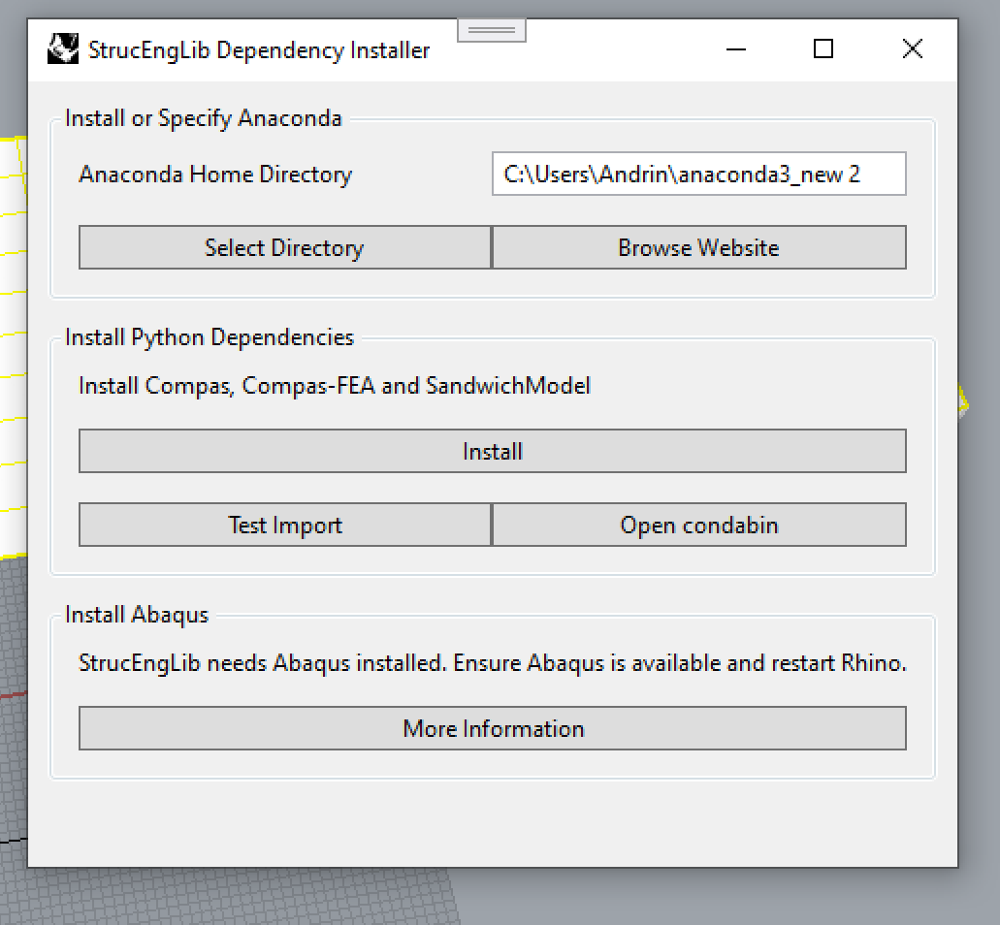

The StrucEngLib plugin issues a Finite Element Analysis Solver under-the-hood.  Ensure to have [Prerequisites](./prerequisites.md) installed before you continue.

## Install Abaqus
Install [Simula Abaqus Software](https://www.3ds.com/products-services/simulia/products/abaqus/). This software is propietary and needs a license. 

!!! note
    - A third party Installation guide for Abaqus can be found [here](https://web.archive.org/web/20220718103200/https://deviceanalytics.com/install-abaqus-on-windows/).
    - Steps to connect to license server for [ETH Zurich members](eth_zurich_members.md).
    - Note that if you are using [StrucEngLib Remote Server](https://strucenglib.ethz.ch/strucenglib_plugin/server/), no finite element analysis solver is required.

## Install Rhinoceros 3D Plugin
Fire up Rhinoceros 3D and type `PackageManager` in Rhino command line. Search for `StrucEngLibPlugin`
in the search bar. Select the latest version, then hit install, and restart
Rhino.

<figure markdown>
  
  <figcaption>Rhino Package Manager</figcaption>
</figure>

!!! note
    - For a list of recent changes, see the [changelog](https://github.com/kfmResearch-NumericsTeam/StrucEng_Library_Plug_in/blob/master/CHANGELOG). 
    - If you are interested in developer builds, enable `Include pre-releases`.

## Menu bar and Command integration
Upon restart, the plugin integrates into Rhino menu bar and is accessible under `Tools` - `StrucEngLib Plugin` as well as in the command line with `StrucEngLib*`.

If plugin load fails with an error, ensure that the plugin is loaded in `PluginManager` settings:  

## Post Installation
Upon installation of the plugin, various Python dependencies must be downloaded.

### Download Dependencies

Type `StrucEngLibInstallDependencies` in Rhino command line to open the dialog shown below.

<figure markdown>
  {width=500px}
  <figcaption>StrucEng Library Dependency Installer</figcaption>
</figure>

Select __Select Directory__ and choose your Anacoda installation path ([Prerequisites](../prerequisites)).
Create a new environment with __Create Environment__. The StrucEngLib Plugin issues Anaconda to create a new virtual environment and
install all required Python dependencies. Hit __Install for Abaqus__ to download the software packages. The installation may take some minutes.

Subsequently, press __Test Import__ to verify installation. Upon failure, an error message is shown.

!!! note
    - The installer uses Compas to install Python dependencies into Rhino's include directory `%AppData%\McNeel\Rhinoceros\7.0\scripts`. 
    - Ensure that your Windows Environment variable `%PYTHONPATH%` is not set.
    - If you changed Rhino's `Modules Search Path` in Python Editor, please remove them ([Why](https://web.archive.org/save/https://compas.dev/compas_fea/latest/gettingstarted/installation.html)).
    - Install Script: [install_abaqus.bat](https://github.com/kfmResearch-NumericsTeam/StrucEng_Library_Plug_in/blob/master/StrucEngLib/EmbeddedResources/install_abaqus.bat).

 
